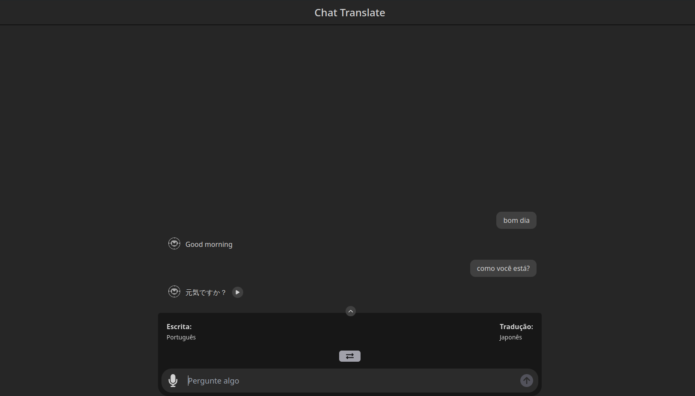

# Live Translator Web

Este projeto é a parte front-end de um tradutor em formato de chat, desenvolvido usando Vite, React.js e Tailwind CSS.

## Funcionalidades
- Tradução em tempo real
- Suporte para múltiplos idiomas
- Interface amigável e responsiva


## Tecnologias Utilizadas
- [React](https://reactjs.org/)
- [Vite](https://vitejs.dev/)
- [Tailwind CSS](https://tailwindcss.com/)

## Instalação

Para instalar e executar este projeto localmente, siga os passos abaixo:

### Pré-requisitos
- Node.js (versão 14 ou superior)
- npm ou [Pnpm](https://pnpm.io/pt/installation)  

### Passos

1. Clone o repositório:
    ```bash
    git clone https://github.com/KristoferBorges/live-translator-web.git
    ```
2. Navegue até o diretório do projeto:
    ```bash
    cd live-translator-web/front
    ```
3. Instale as dependências:
    ```bash
    npm install
    # ou
    pnpm install
    ```

4. Execute o projeto:
    ```bash
    npm run dev
    # ou
    pnpm run dev
    ```

5. Abra o navegador e acesse:
    ```
    http://localhost:5173
    ```

## Componentes Principais

### `Input.jsx`
Componente de input usando "Compound Components".

#### Funcionalidades:
- Facilitar o uso de icones ao lado do campo de input ou botões.

### `ChatTranlate.jsx`
Componente que mostra o chat.

#### Funcionalidades:
- Mostrar o chat do usuario e bot;
- Funções de play e pause da tag audio abaixo do componente;
- useEffect para scroll sempre para baixo quando uma nova mensagem é enviada.

### `Footer.jsx`
Componente de footer  

#### Funcionalidades:
- usando APi speechRecognize para uso do microfone, transcrevendo a voz do usuário em forma de texto e enviando para o chat;
- Responsavel pelo envio da mensagem para a função sendMessage no arquivo `TranslatorContext.jsx`.

### `LanguageSelect.jsx`
Componente de seleção de linguagem para enviar a API.

#### Funcionalidades:
- Campo mostrando linguagem de escrita e tradução para facilitar o uso do APP;
- Campo em forma de pop-up ao clicar no primeiro campo visivel para seleção e pesquisa de linguagens disponiveis;

## `Tooltip.jsx`
Componente responsavel pelas mensagens de ajuda 

### Funcionalidades:
- Mostrar mensagem de ajuda ao pasar o mouse sobre o elemento;
- Passando a propriedade ```position='posição desejada'``` para selecionar a orientação da tooltip e ```content="conteudo a ser mostrado"``` para mostra o texto que irá aparecer ao passar o mouse sobre o elemento

### `TranslatorContext.jsx`
Provedor de funções e estados para o restante da aplicação

#### Funcionalidades:
- Prover estados de linguagem selecionada, chat(usuário e bot), campo de mensagem do usário e carregamento da resposta vindo da API;
- função sendMenssage responsavel pelo:
  - tratamento do chat de usuario e bot;
  - requisição do texto e audio traduzidos;
  - criação do blob do audio e inserir a URL dentro do estado audioURl;
  - Inserir os dados de linguagem selecionadas no localStorage
- useEffect para pegar o localStorage e inserir dentro do estado langChoice. 

### `api.js`
Arquivo para gerenciar funções relacionadas a POST e GET dentro da API

#### Funcionalidades:
- facilidade em troca de URL da API;
- Funções que retornam objetos com o necessario para fazer requisitção POST e GET dentro do AXIOS e FETCH.

### `languagesAvailable.js`
Arquivo com nome e abrevição de todas as linguagens disponiveis no APP

#### Funcionalidades:
- prover um ARRAY a ser utilizado no `ChatTranslate.jsx`
